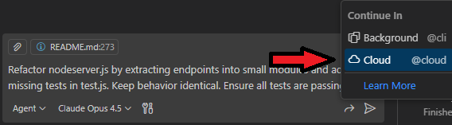

# Goal

The goal is to create a Minimal WebAPI using .NET 8.0 and a corresponding Docker image with the help of GitHub Copilot.
Follow the instructions below and try to use GitHub Copilot as much as possible.
Try different things and see what GitHub Copilot can do for you, like generating a Dockerfile or a class, add comments, etc.

> Make sure GitHub Copilot is configure and enabled for the current laguage, just check the status bar on the bottom right corner of VS Code.

## Instructions

The `dotnet` folder contains the `MinimalAPI.sln` solution, with 2 projects:

- `MinimalAPI` is a minimal WebAPI project created using `dotnet new webapi -minimal`
- `MinimalAPI.Tests` is a minimal xUnit project created using `dotnet new xunit`

To run the tests, open a terminal in the `dotnet` folder and run:

``` bash
dotnet test
```

To run the app, open a terminal in the `dotnet` folder and run:

**Windows environments**
``` bash
dotnet run --project .\MinimalAPI\MinimalAPI.csproj
```

**Codespaces, Linux & Unix environments**
``` bash
dotnet run --project ./MinimalAPI/MinimalAPI.csproj
```

### Exercise 1: Introduction

- Inside `MinimalAPI\Program.cs` add a new Hello World endpoint at `/` that returns a `Hello World!` string. You can test the Copilot inline feature by pressing `ctrl + i`. Then write in the text box the desired behaviour. 
- Run `dotnet test`
- If test pass you should see something like this:

``` bash
Microsoft (R) Test Execution Command Line Tool Version 17.6.0 (x64)
Copyright (c) Microsoft Corporation.  All rights reserved.

Starting test execution, please wait...
A total of 1 test files matched the specified pattern.

Passed!  - Failed:     0, Passed:     1, Skipped:     0, Total:     1, Duration: < 1 ms - MinimalAPI.Tests.dll
```

### Exercise 2: Building new functionalities


Inside `MinimalAPI\Program.cs` add the following endpoints using the help of Copilot:

- **/DaysBetweenDates**: 

    * calculate days between two dates
    * receive by query string two parameters `date1` and `date2`, and calculate the days between those two dates.

> **_NOTE:_** Use above information inside the Copilot inline feature in the `Program.cs` file. Press enter and wait for Copilot to suggest you the code.

- **/validatephonenumber**: 

    * receive by querystring a parameter called phoneNumber
    * validate phoneNumber with Spanish format, for example `+34666777888`
    * if phoneNumber is valid return true

> **_NOTE:_** Use above information inside a comment in the `Program.cs` file. Press enter and wait for Copilot to suggest you the code.

- **/validatespanishdni**:

    * receive by querystring a parameter called dni
    * calculate DNI letter
    * if DNI is valid return "valid"
    * if DNI is not valid return "invalid"

> **_NOTE:_** Use above information inside a comment in the `Program.cs` file. In this case, you may want to see multiple solutions from Copilot to pick the one that best fits the way to calculate the letter. In order to see the firs 10 suggestions from Copilot press `ctrl + enter`. 

- **/returncolorcode**:

    * receive by querystring a parameter called color
    * read colors.json file and return the rgba field
    * get color var from querystring
    * iterate for each color in colors.json to find the color
    * return the code.hex field

> **_NOTE:_** Lets try Copilot chat now. Paste the above information and make it as detailed as possible in the Copilot chat text box. Copilot will use by default the open file as context in order to generate the suggestion.

- **/tellmeajoke**:

    * Make a call to the joke api and return a random joke

> **_NOTE:_** Here's example where you might need to use you own knowledge and judgement
to validate that Copilot follows best practices. Just because Copilot mimic 
what many developers do, doesn't always mean it's the correct way. You might need 
to be extra specific in your prompt to let Copilot know what's best practices. 
_Hint: Pay attention to HttpClient._
        
- **/moviesbydirector**:

    * Receive by querystring a parameter called director
    * Make a call to the movie api and return a list of movies of that director
    * Return the full list of movies

> **_NOTE:_** This will require to browse to https://www.omdbapi.com/apikey.aspx and request a FREE API Key

- **/parseurl**:

    * Retrieves a parameter from querystring called someurl
    * Parse the url and return the protocol, host, port, path, querystring and hash
    * Return the parsed host

> **_NOTE:_** Copilot can help you learn new frameworks.

- **/listfiles**:

    * Get the current directory
    * Get the list of files in the current directory
    * Return the list of files

> **_NOTE:_** Copilot can also help with these kind of commands locally. The feature is called Copilot in the CLI. You can learn more information about this feature [here](https://docs.github.com/en/copilot/github-copilot-in-the-cli/about-github-copilot-in-the-cli).

- **/GetFullTextFile**:

  * Read `sample.txt`` and return lines that contains the word "Fusce"

  > **_NOTE:_** Becareful with this implementation, since this normally reads the full content of the file before analizing it, so memory usage is high and may fail when files are too big.
  >
  > You can use Copilot Code completion or inline chat. Once done you can also use Copilot Inline Chat to refactor the code to put this logic in a function.

- **/GetLineByLinefromtTextFile**:

  * Read `sample.txt` line by line
  * Create a promise to read the file line by line, and return a list of lines that contains the word "Fusce"
  * Return the list of lines

  > **_NOTE:_** You can use Copilot Code completion or inline chat. Once done you can also use Copilot Inline Chat to refactor the code to put this logic in a function.

- **/calculatememoryconsumption**:

    * Return the memory consumption of the process in GB, rounded to 2 decimals

- **/randomeuropeancountry**:

    * Make an array of european countries and its iso codes
    * Return a random country from the array
    * Return the country and its iso code

### Exercise 3: Document the code

Documenting code is always a boring and painful task. However, we can use Copilot to document it for us. In the chat, ask Copilot to document the Program.cs file. 

### Exercise 4: Building tests

We will create automated tests to check that the functionality of the previous endpoints is correctly implemented. The tests should be together in the `MinimalAPI.Tests\IntegrationTests.cs` file.

You can leverage Copilot to run the tests. There is a `/tests` command that you can directly run from Copilot Chat or by selecting the piece of code you want to create tests for and using the Copilot inline feature. 

### Exercise 5: Create a Dockerfile

Now that we have the new functionality added and tests covering it, lets create a Dockerfile for the Minimal API project. 

- Build the image using Copilot and run the app on port 8080

``` powershell
docker build -t dotnetapp .
docker run -d -p 8080:80 --name dotnetapp dotnetapp
```

### Exercise 6: Customize Copilot (repo, path, file)

This exercise demonstrates how Copilot Custom Instructions work together at various scopes. The instructions below are examples, feel free to modify these instructions to see the effects.

1) Create a repo-level instructions file (broad and language-agnostic)
- Location: `.github/copilot-instructions.md` (create the `.github/` folder if needed)
- Paste this content:

```md
# Copilot Instructions (Repository)
- Respect existing language/framework choices across the repo.
- Prefer small, readable functions; clear names; minimal dependencies.
- Add brief docstrings/comments for new code.
- Write tests using existing tooling in each folder when present.
- Avoid secrets and hardcoded credentials; prefer environment variables.
- When unsure, follow conventions shown in nearby files and READMEs.
```

2) Add path-specific instructions for this .NET exercises folder
- Location: `.github/instructions/dotnet.instructions.md`
- Paste this content:

```md
---
applyTo: "exercisefiles/dotnet/**"
---

- Target port: 8080 for servers in this folder.
- Use HttpClient with IHttpClientFactory for HTTP calls; handle errors with try/catch.
- Prefer async/await and minimal API patterns; avoid static state.
- Tests: xUnit; name tests descriptively.
- Add tests to the existing `IntegrationTests.cs` file.
- Include a top comment: "Exercise 6: .NET path rules" in new or edited files here.
```

3) Add file-type targeted instructions for `csharp` files
- Location: `.github/instructions/csharp.instructions.md`
- Paste this content:

```md
---
applyTo: "**/*.cs"
---

- Keep endpoints small and pure; reuse existing patterns in this file.
- Prefer async/await; avoid blocking calls.
- Add XML documentation comments for any new endpoint.
- Include a visible comment at the top: "Exercise 6: C# file rules".
```

4) Try it out
- Open `exercisefiles/dotnet/MinimalAPI/Program.cs` and in Copilot Chat ask: "Add a tiny health-check endpoint"
- Open `exercisefiles/dotnet/MinimalAPI.Tests/IntegrationTests.cs` and ask: "Add one xUnit test for the health-check endpoint"

### Exercise 7: Add a Reusable Prompt to This Repo

Create a repo-scoped, reusable prompt that anyone can invoke from Copilot Chat for consistent, repeatable results.

1) Create the prompt library folder
- Add a new folder: `.github/prompts/`

2) Add the reusable prompt file
- Create `.github/prompts/onboarding.prompt.md` with the content below:

```md
---
agent: 'ask'
model: 'GPT-5.1'
description: 'Help new team members onboard with a phased plan and suggestions for first tasks.'
---

# Create My Onboarding Plan

I'm a new team member working with this repository's ${input:language:Language or persona} exercise files and I need help getting started.

My background: ${input:background:Briefly describe your experience level - new to tech, experienced developer new to this stack, etc.}

Please create a personalized onboarding plan to help me ramp up effectively. The plan should include:

1. A phased approach to learning the codebase and tools over the first 30, 60, and 90 days.
2. Suggested first tasks or issues I can work on to get familiar with the project.
3. Key resources or documentation I should review.
4. Any recommended team members I should connect with for guidance.
```

3) Use the prompt from Copilot Chat
- Open Copilot Chat and type `/onboarding language:dotnet background:new developer` and press enter.
- Notice that the prompt switches to ASK mode with model GPT-5.1, as these were specified in the prompt file.

4) Verify repeatability
- Experiment re-running the prompt using one of the other languages or personas listed in `exercisefiles/` and/or changing your `background:`.

#### Stretch ideas
- Add another prompt (e.g., `.github/prompts/release-notes.prompt.md`) to generate release notes from merged PRs.

### Exercise 8: Automate GitHub Workflows with MCP (Create an Issue)

Configure the GitHub MCP server and use Copilot Chat to create, list, comment on, and close issues in this repository without leaving the editor.

> **_NOTE:_** Ensure issues are enabled, located under the features heading in your repository settings.


#### Steps

- Install GitHub MCP Server:

  - [](https://insiders.vscode.dev/redirect/mcp/install?name=github&config=%7B%22type%22%3A%20%22http%22%2C%22url%22%3A%20%22https%3A%2F%2Fapi.githubcopilot.com%2Fmcp%2F%22%7D)

- Create an issue via Copilot Chat:
  - Prompt: "Using the 'github' MCP server, create a new issue in <owner>/<repo> (replace <owner>/<repo> with your repository, for example `octocat/hello-world`) titled 'Exercise 8: MCP issue demo' with body 'Please verify MCP can create issues from VS Code.' Assign to me if possible."

- Verify the result:
  - Copilot should return an issue URL.
  - Alternatively, ask: "List open issues in <owner>/<repo> with label 'exercise-8'."

- Update the issue:
  - Add a comment: "Comment on issue #<number>: 'Thanks, this was created via MCP.'"
  - Close it: "Close issue #<number>."

### Exercise 9: Run the Copilot coding agent asynchronously

- In VSCode, start a Copilot coding agent task that works asynchronously:
  - Request: "Refactor Program.cs by extracting endpoints into small modules and add missing tests in IntegrationTests.cs. Keep behavior identical. Ensure all tests are passing"
  - Instead of pressing <kbd>Enter</kbd> to send the chat message to GitHub Copilot, click the arrow in the bottom right of the chat window and choose continue in cloud:
  
- While the agent runs:
  - Continue local work and periodically check the agent's progress and PR status.
  - Review the PR once available and ask Copilot Chat "/explain" on the diff to understand the changes.

  > **_NOTE:_** The coding agent operates asynchronously and may iterate. Provide clear constraints and accept/reject changes via normal PR review.


### Exercise 10: Create and use a custom agent tailored to this folder (Coming Soon)
<!--
- Define a custom agent specialized for exercisefiles/dotnet:
  - Default context: exercisefiles/dotnet
  - Tools: MCP filesystem and HTTP, Copilot Chat commands (/tests, /fix, /explain)
  - Behaviors: propose small changes with tests, respect custom instructions and prompt files, avoid secrets, and prefer HttpClient with IHttpClientFactory for HTTP calls with error handling.
- Use your custom agent:
  - Ask it to "review Program.cs for input validation gaps and propose minimal fixes with corresponding xUnit tests."
  - Ask it to "suggest documentation updates in README for new endpoints, consistent with Exercises 1–5."

  > **_NOTE:_** Custom agents encapsulate preferences and tools so you get consistent guidance without repeating context every time.
-->


<!--
Exercise 11?
Copilot setup steps tutorial to customize coding agent
-->